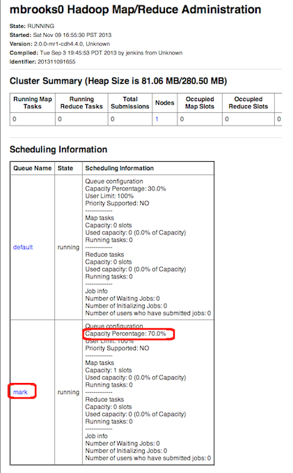

cm-set-task-scheduler
=======================

This project provides an example of using Cloudera Manager's Python API Client to set a MapReduce Task Scheduler configuration file and to refresh a running JobTracker so the new scheduler configuration is put into effect.  This functionality may be desirable for shops that wish to change queue capacities or limits at different times of day.

More information: [Cloudera Manager](http://www.cloudera.com/content/cloudera/en/products/cloudera-manager.html), [CM API Client](http://cloudera.github.io/cm_api/)

####Requirements
- Cloudera Manager 4.5 or higher (I tested with CM 4.7.2) with HDFS and MapReduce Services configured. 
- CM login with Administrator privileges
- CDH 4.1 or higher (I tested with CDH 4.4.0)
- Python (I tested on CentOS 6.4 using Python 2.6.6)
- Python setuptools (see below)
- CM API must be installed (see below)

####Install Python setuptools and unzip
On CentOS:

    # yum -y install python-setuptools
    # yum -y install unzip

####Download and Install the Cloudera Manager API Client
Download the CM API Client for your version of CM.  I am using CM 4.7.2, so I will use the cm-4.7 version of the API:

    # wget wget https://github.com/cloudera/cm_api/archive/cm-4.7.zip
    # unzip cm-4.7

This will create a dir named cm_api-cm-4.7

Change to the cm-api's python directory and install the CM-API module (see the README and SHELL_README for additional details):

    # cd cm_api-cm-4.7/python
    # python setup.py install

####Prerequisites

This example assumes you have already set a Task Scheduler.  In this example I have set a Capacity Scheduler:

An initial set of queue names should also be set in advance. Queue names could be set along with the scheduler configs, but in this example the queue names are static; the same queues are simply weighted differently by the different schedulers:

I have started this example by copying the text of the first scheduler config "capacity-scheduler-1.xml" into CM's Capacity Scheduler Configuration.  Note that using this configuration the "mark" queue gets 70% capacity:

The running Task Scheduler's queues and configurations can be seen in Job Tracker's Web UI:

####Create a directory to hold the task scheduler config files.  

I placed three different task scheduler config files in the directory /etc/cloudera-scm-server/task-scheduler-configs  (the location is not critical):

    # [root@mbrooks0 task-scheduler-configs]# pwd
	/etc/cloudera-scm-server/task-scheduler-configs
	
	# ls -l
	-rw-r----- 1 cloudera-scm cloudera-scm 2650 Nov  9 18:56 capacity-scheduler-1.xml
	-rw-r--r-- 1 cloudera-scm cloudera-scm 2650 Nov  9 18:56 capacity-scheduler-2.xml
	-rw-r--r-- 1 cloudera-scm cloudera-scm 2650 Nov  9 18:56 capacity-scheduler-3.xml

####Edit the CM connection settings and Cluster name in the script .  

Edit the following properties in the script as needed:

	## Cloudera Manager Host
	cm_host = "localhost"
	cm_port = "7180"

	## Cloudera Manager login
	cm_login = "admin"

	## Cloudera Manager password
	cm_password = "admin"

	## Cluster Name
	cluster_name = "Cluster 1 - CDH4"

	## Service config property name
	config_property_name = "mapred_capacity_scheduler_configuration"   # Capacity Scheduler config property name
	# config_property_name = "mapred_fairscheduler_allocation"         # Fair Scheduler config property name

####Run the script to set a different scheduler config

To deploy capacity-scheduler-2.xml, execute the command:

	# ./set-task-scheduler.py /etc/cloudera-scm-server/task-scheduler-configs/capacity-scheduler-2.xml

 
You should see output like this:

	# ./set-task-scheduler.py /etc/cloudera-scm-server/task-scheduler-configs/capacity-scheduler-2.xml 

	Setting task scheduler config file: /etc/cloudera-scm-server/task-scheduler-configs/capacity-scheduler-2.xml
	Cluster: Cluster 1 - CDH4
	MapReduce Service :mapreduce1

	New task scheduler configuration set

	Refreshing the Job Tracker on mbrooks0.onefoursix.com

	Done

The updated Task Scheduler's queues and configurations can now be seen in Job Tracker's Web UI:

