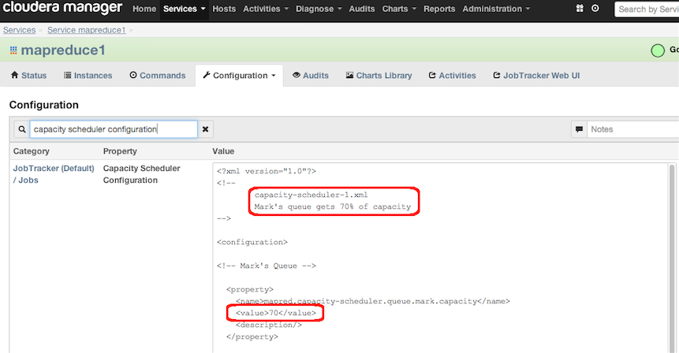

cm-set-task-scheduler
=======================

This project provides an example of using Cloudera Manager's Python API Client to set a MapReduce Task Scheduler configuration file and to refresh a running JobTracker so the new scheduler configuration is put into effect.  This functionality may be desirable for shops that wish to dynamically change queue capacities or limits at different times of day, for example to allow certain batch jobs to consume a higher percentage or resources between midnight and 3:00am than during working hours.

More information: [Cloudera Manager](http://www.cloudera.com/content/cloudera/en/products/cloudera-manager.html), [CM API Client](http://cloudera.github.io/cm_api/)

####Requirements
- Cloudera Manager 4.5 or higher (I tested with CM 4.7.2) with HDFS and MapReduce Services configured. 
- CM login with Administrator privileges
- CDH 4.1 or higher (I tested with CDH 4.4.0)
- Python (I tested on CentOS 6.4 using Python 2.6.6)
- Python setuptools (see below)
- CM API must be installed (see below)

####Install Python setuptools
On CentOS:

    # yum -y install python-setuptools

####Download and Install the Cloudera Manager API Client
Download the CM API Client:

    # wget https://github.com/cloudera/cm_api/tarball/master
    # tar -xvf master

This will give you a dir named something like <code>cloudera-cm_api-d5e8ac0<code>

Change to the cm-api's python directory and install the CM-API module (see the README and SHELL_README for additional details):

    # cd cloudera-cm_api-d5e8ac0/python
    # python setup.py install

####Prerequisites

This example assumes you have already set a Task Scheduler.  In this example I have set a Capacity Scheduler:

An initial set of queue names should also be set in advance.  In this example, the two queue named "default" and "mark" remain constant across the different scheduler configurations.  Queue names could be set dynamically along with the scheduler configs, but in this example they are static; the same queues are simply configured differently by the different schedulers.  :

Finally, I have started this example by copying the text of my first scheduler config "capacity-scheduler-1.xml" into CM's Capacity Scheduler Configuration.  Note that using this configuration the "mark" queue gets 70% capacity:

The running Task Scheduler's queues and configurations can be seen in Job Tracker's UI.  Note that the "mark" queue gets 70% of capacity:

####Create a directory to hold the task scheduler config files.  

For this example I have placed three different task scheduler config files in a directory I created named /etc/cloudera-scm-server/task-scheduler-configs.  Change ownership of the directory and your config files to cloudera-scm:

    # [root@mbrooks0 task-scheduler-configs]# pwd
	/etc/cloudera-scm-server/task-scheduler-configs
	
	# ls -l
	-rw-r----- 1 cloudera-scm cloudera-scm 2650 Nov  9 18:56 capacity-scheduler-1.xml
	-rw-r--r-- 1 cloudera-scm cloudera-scm 2650 Nov  9 18:56 capacity-scheduler-2.xml
	-rw-r--r-- 1 cloudera-scm cloudera-scm 2650 Nov  9 18:56 capacity-scheduler-3.xml

